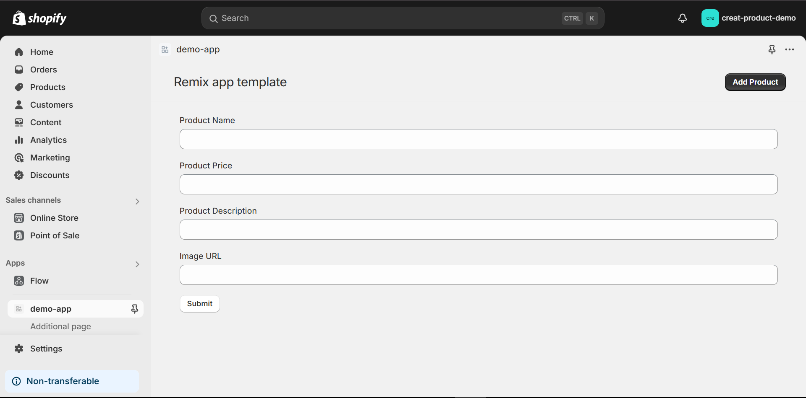
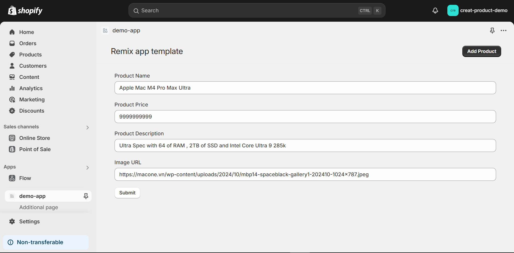
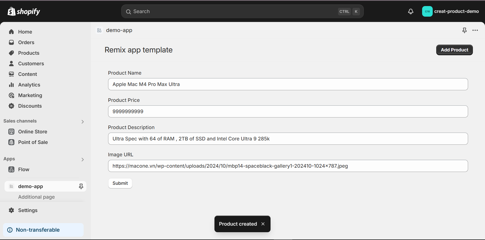
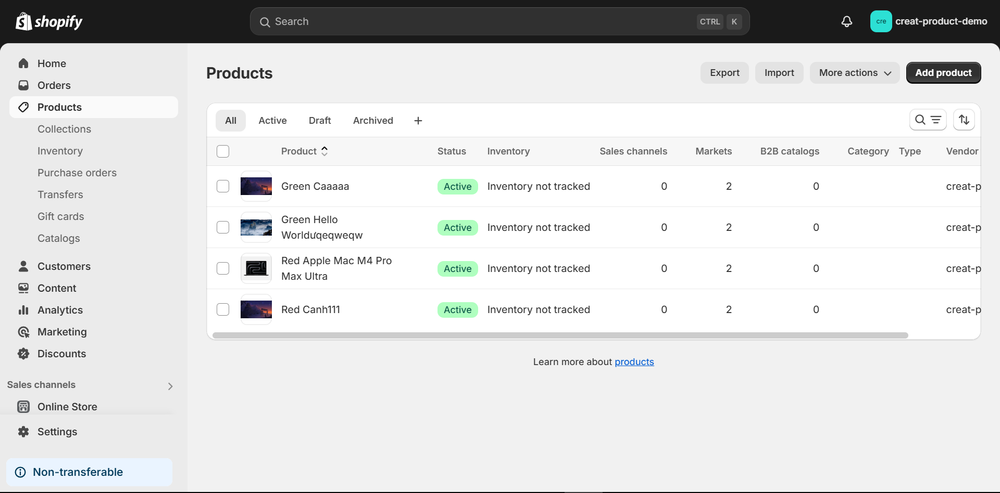
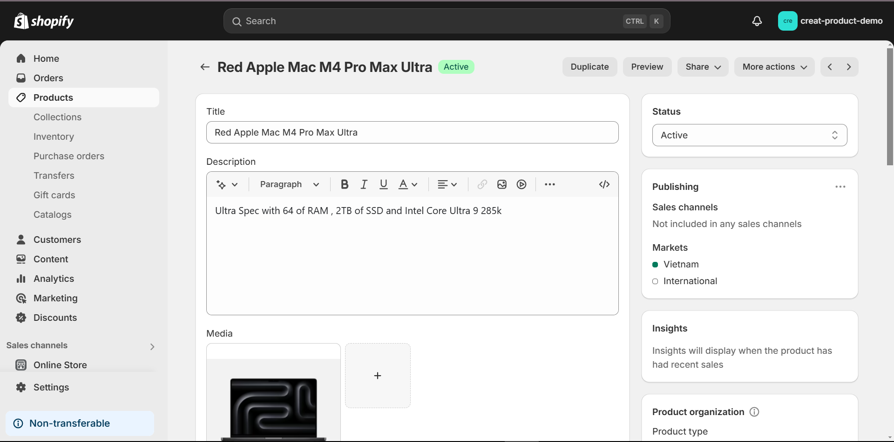
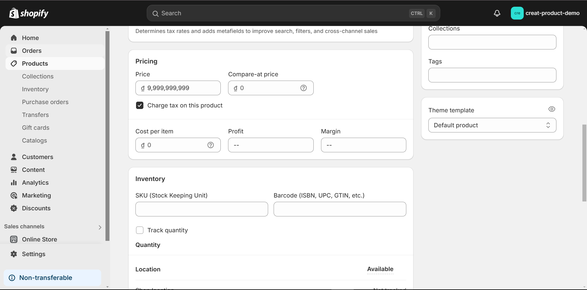
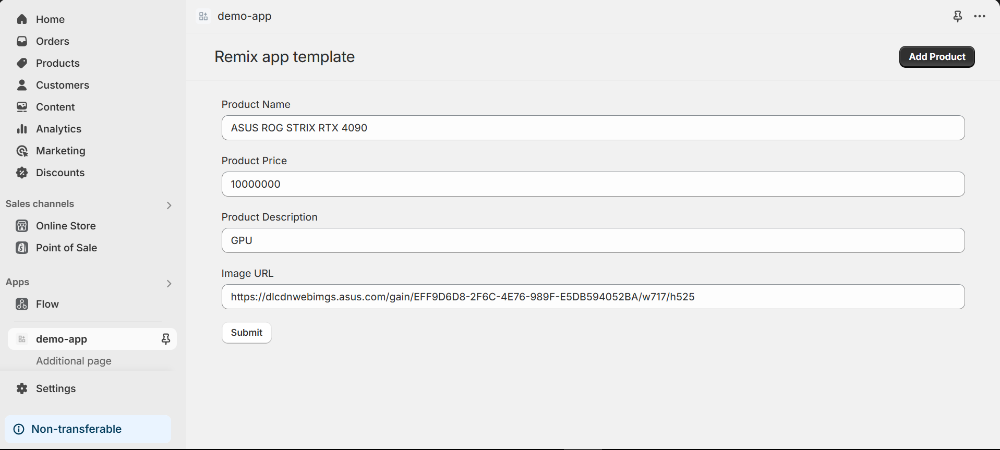

Bài test 1: Micro-service tạo sản phẩm trên shopify
Form Input Data

Input Data

Success Add Product

Check PRoduct

Input: Là Data nhập từ form gồm name, description, price, imageURL
Các trường trên sẽ được đổi thành các trường tương ứng của product shopify như title , descriptionHTML, variant.price , product.media
Phần product Media ở đây e sử dụng url vì đã thử qua cách chuyển sang base64 từ file picker dropzone của shopify components nhưng không thành công nên dùng url là hợp lý và đơn giản nhât
Ví dụ dưới đây
name : ASUS ROG STRIX RTX 4090
description: GPU
imageURL : https://dlcdnwebimgs.asus.com/gain/EFF9D6D8-2F6C-4E76-989F-E5DB594052BA/w717/h525
price: 10000000

Output sẽ là một product được tạo thành công cũng sẽ có thông báo toast hiển thị. Nếu xảy ra lỗi sẽ hiện lỗi cho người dùng biết
Output sẽ gồm các thông tin đã nhập từ form , các thông tin khác chưa nhập sẽ để trống hoặc mặc định
{
"cursor": "eyJsYXN0X2lkIjo5NzYwODQyMzgzNjU5LCJsYXN0X3ZhbHVlIjoiR3JlZW4gQVNVUyBST0cgU1RSSVggUlRYIDQwOTAifQ==",
"node": {
"id": "gid://shopify/Product/9760842383659",
"title": "Green ASUS ROG STRIX RTX 4090", đúng tên đã nhập , từ green là phần kiểm tra xem name có valid hay ko.
"vendor": "creat-product-demo",
"priceRangeV2": {
"minVariantPrice": {
"amount": "10000000.0", đúng số tiền đã nhập
"currencyCode": "VND",
"**typename": "MoneyV2"
},
"maxVariantPrice": {
"amount": "10000000.0",
"currencyCode": "VND",
"**typename": "MoneyV2"
},
"**typename": "ProductPriceRangeV2"
},
"productType": "",
"combinedListingRole": null,
"combinedListing": null,
"standardizedProductType": null,
"totalVariants": 1,
"totalInventory": 0,
"status": "ACTIVE",
"tracksInventory": false,
"onlineStoreUrl": null,
"hasOnlyDefaultVariant": true,
"isStaticBundle": false,
"isBundle": false,
"featuredImage": {
"id": "gid://shopify/ProductImage/47988678787371",
"transformedSrc": "https://cdn.shopify.com/s/files/1/0907/5680/9003/files/h525_a1d57006-8eaa-42df-957d-8b429f1f3a41_40x40@3x.png?v=1730539938",
"**typename": "Image"
},
"activeSuspension": null,
"featuredMedia": {
"id": "gid://shopify/MediaImage/40144355918123",
"**typename": "MediaImage",
"preview": {
"image": {
"id": "gid://shopify/ImageSource/40164532617515",
"transformedSrc": "https://cdn.shopify.com/s/files/1/0907/5680/9003/files/h525_a1d57006-8eaa-42df-957d-8b429f1f3a41_40x40@3x.png?v=1730539938",
"**typename": "Image"
},
"**typename": "MediaPreviewImage"
}
},
"channelPublicationCount": 0,
"marketPublicationCount": 2,
"companyLocationPublicationCount": 0,
"retailCatalogPublicationCount": 0,
"**typename": "Product",
"isGiftCard": false,
"appMetafield": null,
"stagingAppMetafield": null,
"mockAppMetafield": null
},
"\_\_typename": "ProductEdge"
},

Cách làm : Sau khi đọc và tham khảo source code chính mà shopify tạo với câu lệnh khởi tạo dự án , có một api
của graphql để tự tạo các sản phẩm . Tham khảo api đó và lên xem doc của GraphQL API Admin của shopify và tìm create product.
Sau đó xem docs và tiếp tục nghiên cứu và triển khai. Tiếp tục với ProductCreateMedia. Đơn giản là xem docs của api của họ rồi
chỉnh sửa và làm theo nhu cầu của mình.
Trước khi làm API thì phải xem cách tạo giao diện , có 2 kiêu giao diện là html và react. Em chọn react sau đó tìm các component của giao diện shopify và xây dụng formdata cũng như hoàn thành các hanle cần thiết để kết hợp với API viết ở remix.

Công nghệ : Các công nghệ sử dụng bao gồm Shopify, Node, Remix, GraphQL API ADMIN
Kết quả : Hoàn thành bài test đúng với yêu cầu đề ra , giao diện đơn giản dễ dùng , có validate cho form.
Ứng dụng : có thể dùng cho một trang web quản lý sản phẩm đơn giản
